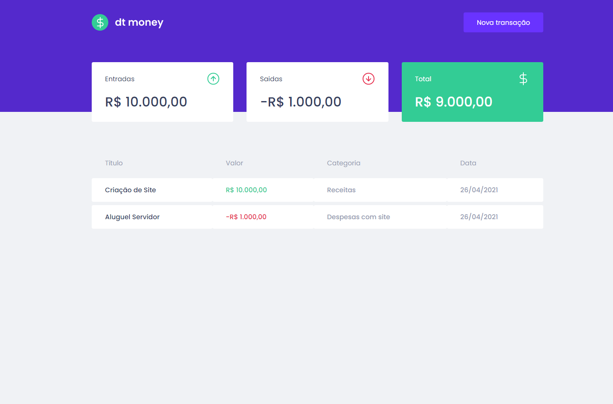
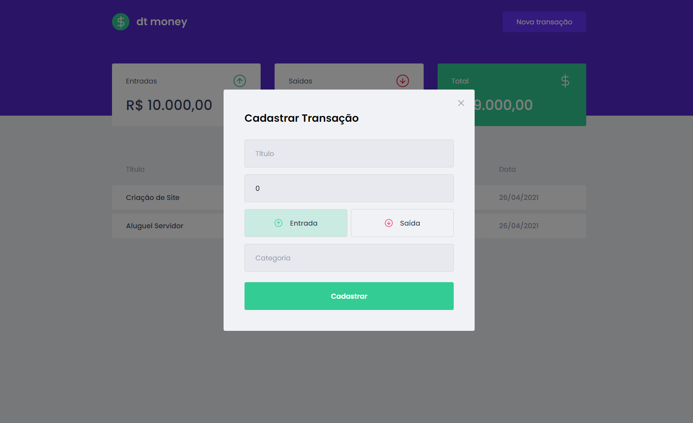

[](https://choosealicense.com/licenses/mit)
[](https://pt-br.reactjs.org/)
[](https://github.com/renanlido/dt_money-Ignite/commits)
[](https://rocketseat.com.br)

<!--LOGO-->
<br/>
<div align="center">
    <a href="">
        
    </a>
    <h3 color="#ffff" >Control your money!</h3>
    </br>
</div>

<!-- ABOUT THE PROJECT -->
# <strong>Sobre o Projeto</strong>
Este projeto visa a criação de um aplicativo de controle financeiro utilizando o React.js desenvolvido em aula no curso [Ignite da Rocketseat](https://rocketseat.com.br).

</br>

# <strong>Tecnologias Utilizadas</strong>
### Neste projeto utilizamos: 
<strong>[ReactJs](https://pt-br.reactjs.org/)</strong> : Uma biblioteca JavaScript para criar interfaces de usuário. A tecnologia NextJs roda com ReactJs por baixo dos panos o que nos permite ter flexibilidade de criar e reutilizar componentes além de utilizar a metologia SPA (Single Page Aplication) em algumas páginas do projeto.

<strong>[Styled Components](https://styled-components.com/)</strong> : Pacote para componentizar css e utliza-lo em cascata.

</br>

<!--INSTALATION-->

# Instalação

1. Para instalar e utilizar este projeto o processo é bem simples, após clonar o projeto utilize o comando:
    ```sh
    yarn
    ```
    Caso não tenha o yarn instalado, utilize o gerenciador de pacotes da sua preferência.        

<br/>

2. Após isto, utilize o comando abaixo para rodar o aplicativo.
    ```ssh 
    yarn start 
    ```
</br>

<!--THE RESULT-->

# <strong>O resultado!</strong>


<div>
    </br>
</div>



<div>
    </br>
</div>

<!-- LICENSE -->

# **Licença**

Distribuído sob a licença MIT. Veja `LICENSE` para mais informações.

<!-- CONTACT -->
</br>

# **Contato**

### Renan Oliveira - **renanlido@yahoo.com.br**

[Github](https://github.com/renanlido) - **https://github.com/renanlido** </br>
[Linkedin](https://www.linkedin.com/in/renanlido/) - **https://www.linkedin.com/in/renanlido/**

</br></br>
Obrigado por ter vindo 😊🤗
